# 전자정부 표준프레임워크 기업업무 공통컴포넌트 (Spring Boot + Thymeleaf)


> 전자정부 표준프레임워크 5.0 기업업무 공통컴포넌트(`enterprise-biz-jsp`, Spring + JSP + WAR)를 **Spring Boot + Thymeleaf(JAR)** 로 전환한 프로젝트입니다.
> JSP 원본의 전 기능(컨트롤러 210개 엔드포인트)을 Thymeleaf 화면으로 구현하고, **KRDS(Korea Design System) 디자인 표준 전면 적용**과 **다국어(한국어/English) 전환**을 완료했습니다.
> 본 저장소는 **단독으로 빌드·실행**됩니다(외부 형제 프로젝트 불필요).

---

## 프로젝트 소개

### 개요

기업·공공 업무시스템의 **내부 관리자 콘솔**(게시판, 업무사용자·권한 관리, 공통코드·메뉴·프로그램 관리, 접속로그·시스템로그·접속통계, 로그인정책·사용자부재 등)을 전자정부 표준프레임워크 5.0 기반 **Spring Boot + Thymeleaf** 로 제공합니다. 개발용 DB는 내장 HSQL을 사용하며, 운영용으로 PostgreSQL 등 6종 DBMS의 DDL/DATA·매퍼를 제공합니다.

### 기술 스택

| 항목 | 내용 |
| :--- | :--- |
| 프레임워크 | eGovFrame Boot 5.0 (RTE 5.0.0) + Spring Boot 3.5.6 + Spring Framework 6.2.11 |
| 언어 / 빌드 | Java 17 / Maven 3.9.9 (eGovCI-5.0.0 내장) |
| 화면 | Thymeleaf 3.1.3 + Layout Dialect 3.4.0 + **KRDS(Korea Design System)** 전면 적용 (공식 `krds.min.css` + 호환 레이어 `krds-compat.css` + `krds.css` + 다크 `theme.css`, 전부 로컬·CDN 미사용. Bootstrap 프레임워크 제거, Bootstrap Icons `bi-*`만 유지) |
| 보안 | 세션 기반 Spring Security 6.5.5 (`HttpSessionSecurityContextRepository`) |
| 데이터 | MyBatis 3.5.19 / 개발=내장 HSQLDB 2.7.4 / 운영=PostgreSQL·MySQL·Oracle·Tibero·CUBRID·Altibase |
| 패키징 | 실행 가능 JAR (`java -jar`), 포트 28080 |

---

## 빠른 시작 (Quickstart)

```bash
# 0) 클론 (JDK 17 + Maven 3.9.9 필요)
git clone https://github.com/gjh999/enterprise-biz-boot.git
cd enterprise-biz-boot

# 1) 빌드
mvn clean package -DskipTests

# 2) 실행 (28080 포트)
java -Dfile.encoding=UTF-8 -jar target/egovframe-boot-enterprise-biz-5.0.0.jar --server.port=28080

# 또는 개발 모드
mvn spring-boot:run -Dspring-boot.run.jvmArguments="-Dfile.encoding=UTF-8" -Dspring-boot.run.arguments=--server.port=28080
```

> Windows PowerShell에서 JAR 실행 시 인자는 배열로 전달하세요.
> `& $java @('-Dfile.encoding=UTF-8','-jar',$jar,'--server.port=28080')`

접속: **http://localhost:28080**

### 테스트 계정

| 구분 | 아이디 | 비밀번호 | 권한 |
| :--- | :--- | :--- | :--- |
| 관리자 | `admin` | `1` | ROLE_ADMIN |
| 사용자 | `user` | `1` | ROLE_USER |

> 비밀번호 저장 형식 = `Base64(SHA-256(id + 평문))` (`EgovFileScrty.encryptPassword`)

---

## 화면 구성

### 로그인

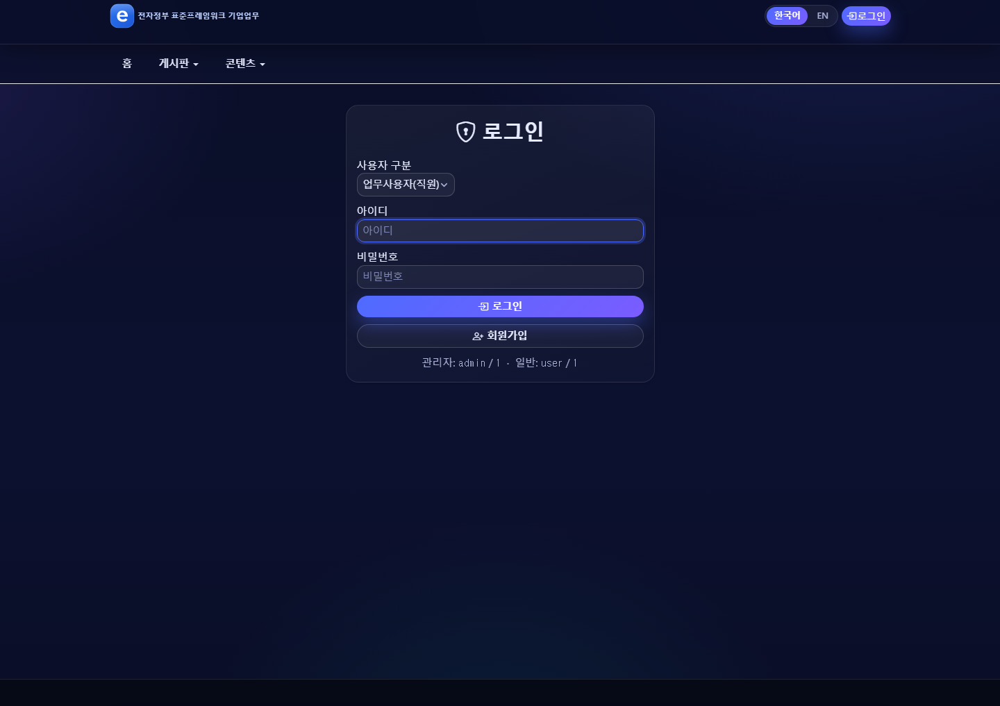

세션 기반 로그인(`POST /uat/uia/actionSecurityLogin.do`). 로그인 후 권한(관리자/사용자)에 따라 메뉴가 노출됩니다.

### 메인 화면

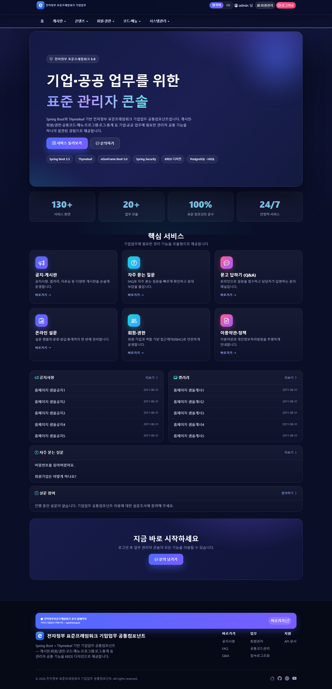

KRDS 다크 테마 랜딩. 상단 네비게이션: **게시판 · 회원·권한 · 코드·메뉴 · 시스템관리(관리자 전용)**

### 공지사항 (게시판)

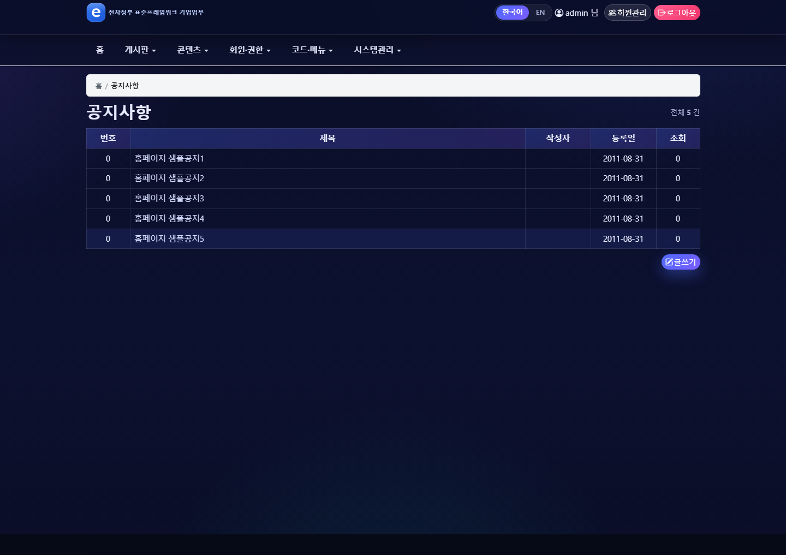

공통컴포넌트 게시판을 커스터마이징. 목록·상세·등록·수정·답글·삭제(논리삭제)와 첨부파일을 지원합니다.

### 업무사용자 관리

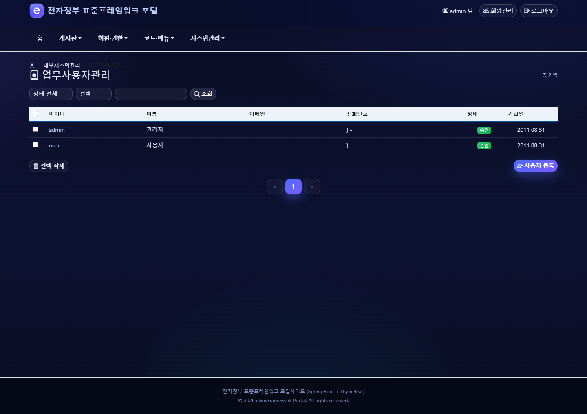

업무사용자(`TB_EMPLYR_INFO`) 등록·수정·비밀번호변경·ID중복확인. 사용자별 권한 부여의 기준 데이터입니다.

### 권한 관리 (관리자)

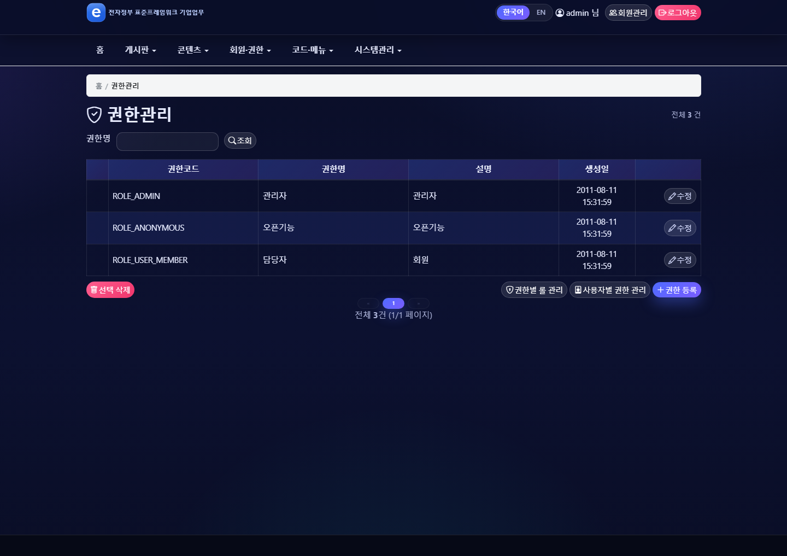

권한·롤·그룹·사용자별 권한 관리. 관리자 전용(`/sec/**`).

### 공통코드 관리

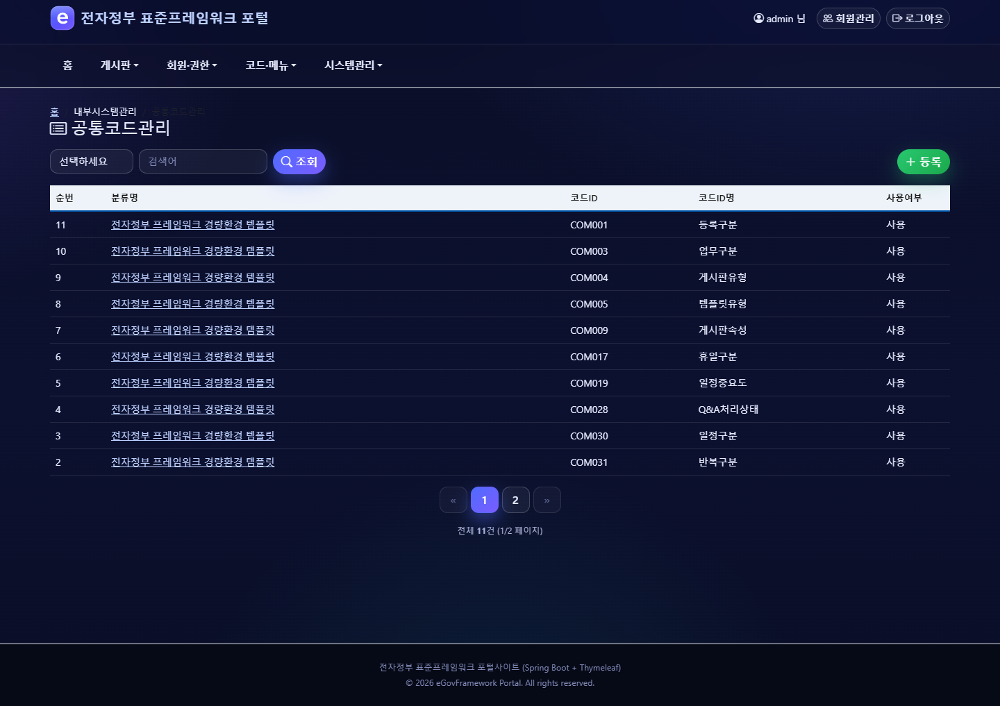

공통분류코드 → 공통코드 → 공통상세코드 계층 관리(`TB_CMMN_CL_CODE` / `TB_CMMN_CODE` / `TB_CMMN_DETAIL_CODE`).

### 메뉴 관리

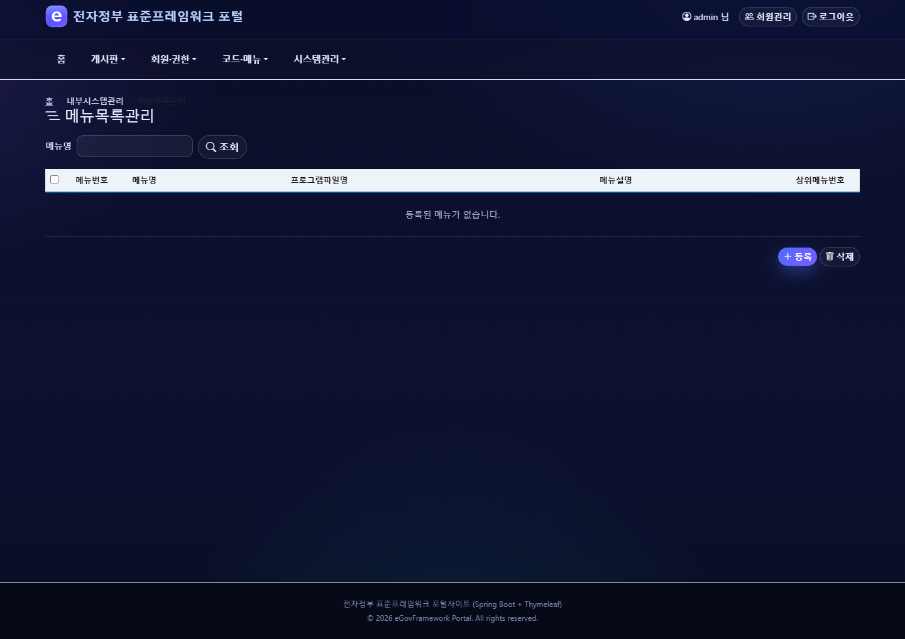

메뉴목록관리·메뉴생성관리(`TB_MENU_INFO` / `TB_MENU_CREAT_DTLS`).

### 프로그램 관리 / 변경요청

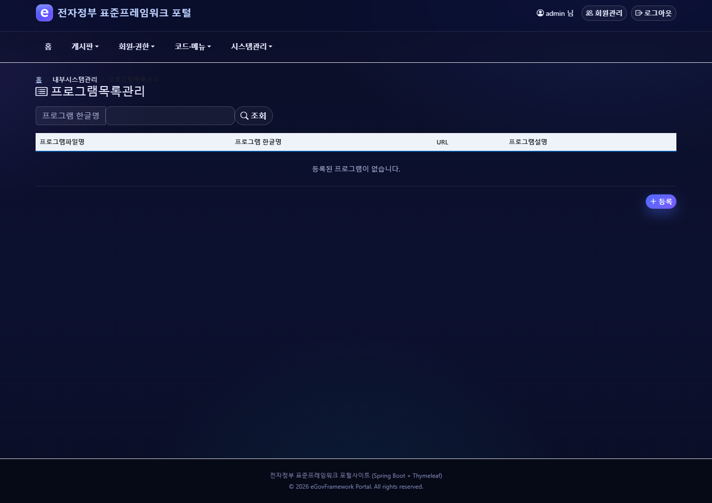

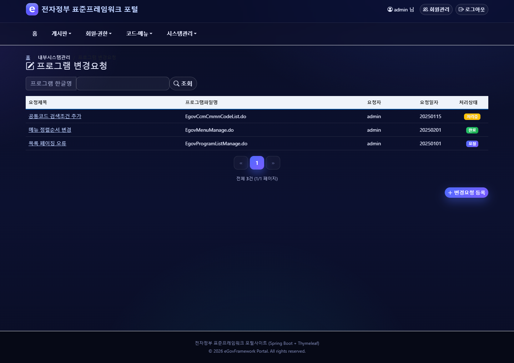

프로그램 목록 관리(`TB_PROGRM_LIST`)와 변경요청 → 변경처리 → 변경이력 워크플로(`TB_PROGRM_CHANGE_DTLS`).

### 접속로그 / 접속통계 (관리자)

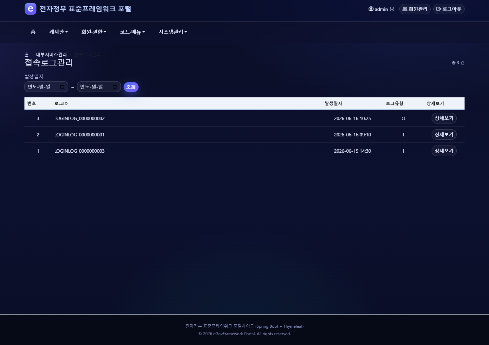

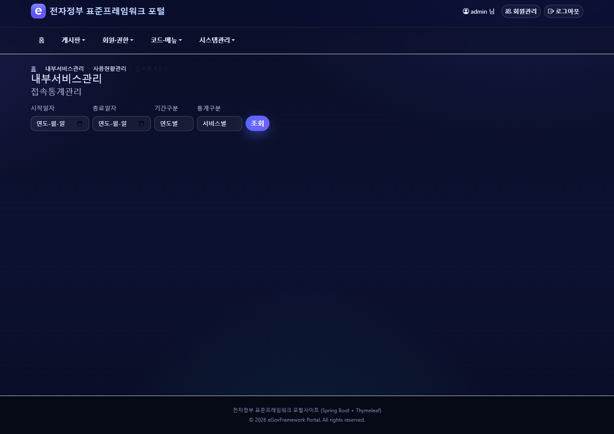

접속로그(`TB_LOGIN_LOG`)·시스템로그(`TB_SYS_LOG`) 모니터링과 서비스별/일자별 접속통계(`TB_CONECT_LOG`).

---

## 기능 모듈

| 영역 | 기능 |
| :--- | :--- |
| 메인·업무프레임(main) | 메인 화면, 업무화면 헤더/푸터/좌측·상단 메뉴(`sym/mms`) |
| 게시판(cop) | 공지/갤러리/자료실 CRUD, 답글, 첨부, 게시판마스터·사용정보·템플릿 |
| 사용자(uss/umt) | 업무사용자관리, 회원관리, 비밀번호 변경, ID중복확인 |
| 보안(sec) | 권한·롤·그룹·사용자별 권한 |
| 로그인·정책(uat) | 로그인/로그아웃, 로그인정책관리 |
| 부재(uss/ion) | 사용자부재관리 |
| 코드(sym/ccm) | 공통분류/공통/상세 코드, 우편번호 |
| 메뉴·프로그램(sym/mnu·sym/prm) | 메뉴목록·메뉴생성, 프로그램관리, 프로그램 변경요청·변경처리·변경이력 |
| 로그·통계(sym/log·sts) | 접속로그·시스템로그 조회, 접속통계 |
| 기준정보(sym/cal) | 휴일관리 |
| 포함 공개모듈 | FAQ·Q&A·설문·배너·약관·개인정보처리방침 (표준 공개모듈 포함, 동작) |

---

## 다국어 (i18n)

전 화면 **한국어 / English** 전환을 지원합니다.

- **전환 방법**: 헤더의 **한국어 / EN** 토글 클릭. 버튼은 `/cmm/lang?lang=ko|en` 으로 이동하며,
  `EgovLangController` 가 선택 언어를 `LANG` 쿠키(`CookieLocaleResolver`, 기본 한국어)에 저장한 뒤
  직전 페이지로 다시 리다이렉트(PRG)합니다. 최종 URL 에는 `?lang` 파라미터가 남지 않습니다.
- **메시지 리소스**: `src/main/resources/egovframework/message/message-ui_ko.properties` / `_en.properties`
  (각각 약 1,436개 키, **키 집합 정합**). Thymeleaf 템플릿 238개를 ko/en 메시지 키로 전환했으며, 화면 하드코딩 한글 잔여 0.
- **규약**: 새 문구는 ko/en 양쪽에 **APPEND** 로만 추가하고 키 집합을 일치시킵니다.
  영어에서 의도적으로 비워 두는 값(예: 단위 접미사, 한국어 전용 부제)은 빈 값(`key=`)으로 유지합니다.

---

## 데이터베이스

- **개발(기본)**: 내장 HSQL — `src/main/resources/db/shtdb.sql` (DDL+DATA)
- **운영**: `DATABASE/{dbms}/all_ebt_ddl_{dbms}.sql`, `all_ebt_data_{dbms}.sql`
  - 지원 DBMS: **PostgreSQL · MySQL · Oracle · Tibero · CUBRID · Altibase** (HSQL 포함 7종)
  - 매퍼는 모듈별 7종 DB 변형 유지, 레거시 테이블 참조(`LETT*`/`COMT*`/`COMVN*`) **0건**
- **명명규칙**: 테이블 `TB_` + snake_case 대문자, 뷰 `VW_`, 모든 테이블 감사컬럼 4종 필수
  (`FRST_REGIST_PNTTM`, `FRST_REGISTER_ID`, `LAST_UPDT_PNTTM`, `LAST_UPDUSR_ID`)
- **DB 전환**: `Globals.DbType`(기본 hsql) + datasource 설정 변경. 매퍼는 `Egov{기능}_SQL_{dbType}.xml`.

---

## 프로젝트 구조

```
enterprise-biz-boot/
├─ src/main/java/egovframework/
│  ├─ EgovBootApplication.java         # Spring Boot 진입점(@SpringBootApplication)
│  ├─ com/config/                      # Java @Configuration (web.xml/context-*.xml 대체)
│  ├─ com/security/                    # 세션 기반 SecurityConfig
│  ├─ com/cmm/                         # 공통 VO·서비스·유틸·파일관리
│  └─ let/                             # 업무 컨트롤러 48종
│     ├─ main/                         #   메인 + 업무프레임(sym/mms)
│     ├─ cop/{bbs,com}/                #   게시판·게시판공통
│     ├─ sec/{gmt,ram,rgm,rmt}/        #   권한·롤·그룹·사용자별권한
│     ├─ sym/ccm/{cca,ccc,cde,zip}/    #   공통/분류/상세 코드·우편번호
│     ├─ sym/mnu/{mcm,mpm}/, sym/prm/  #   메뉴생성·메뉴목록·프로그램
│     ├─ sym/log/{clg,lgm}/, sym/cal/  #   접속로그·시스템로그·휴일
│     ├─ sts/cst/                      #   접속통계
│     ├─ uat/{uia,uap}/                #   로그인·로그인정책
│     └─ uss/{umt,ion,olh,olp,sam}/    #   사용자·부재 / FAQ·Q&A·설문·약관(일부 상속)
├─ src/main/resources/
│  ├─ templates/                       # Thymeleaf 238개 (layouts/default + fragments + 모듈 화면, ko/en 메시지키)
│  ├─ static/                          # KRDS 자산 (krds/resources/cdn/krds.min.css·krds-compat·krds·theme, 로컬 css/js/images)
│  ├─ egovframework/mapper/            # MyBatis 매퍼 288개 (Egov{기능}_SQL_{db}.xml, 7종)
│  ├─ egovframework/message/           # 다국어 메시지 (message-ui_{ko,en}.properties, 각 ~1436키)
│  ├─ db/shtdb.sql                     # HSQL 초기 DDL+DATA
│  └─ application.properties           # 포트 28080 등 설정
├─ DATABASE/{altibase,cubrid,mysql,oracle,postgresql,tibero}/   # 운영 DBMS DDL/DATA (all_ebt_*)
├─ docs/images/                        # README 화면 캡처 11종
├─ CLAUDE.md                           # 코드베이스 컨텍스트/컨벤션
├─ SKILL.md                            # 컨텍스트·하네스 엔지니어링 가이드
└─ pom.xml
```

---

## 참고

- 상세 컨벤션·전환 핵심·함정: [CLAUDE.md](CLAUDE.md)
- 재현 가능한 작업 절차(빌드·검증·DBMS dialect): [SKILL.md](SKILL.md)
- 본 프로젝트는 표준프레임워크 공통컴포넌트 기능 일부를 선정해 구성한 참조용 소스입니다.

---

> 본 코드베이스는 eGovFrame 표준프레임워크 기업업무 공통컴포넌트(업무 관리자 콘솔) 템플릿을 기반으로, Thymeleaf MVC 화면 계층과 **KRDS 디자인 전환·다국어(한국어/English)·보안/스키마 정비**를 더해 새 프로젝트의 출발점으로 사용할 수 있도록 구성되었습니다.
